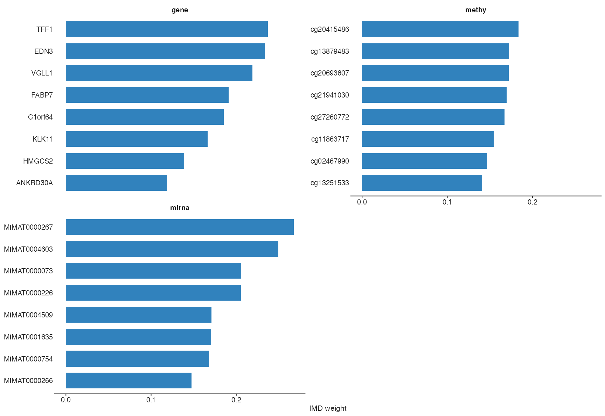
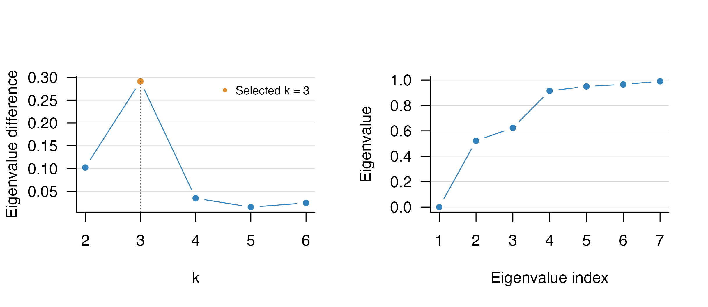

# Using multiRF for Multi-Omics Integration

## Overview

`multiRF` integrates matched multi-omics data with directed multivariate
random forests. The current workflow has four main stages:

1.  fit one forest for each requested response–predictor block
    direction;
2.  construct and fuse sample-level forest weight matrices;
3.  separate shared from block-specific signal and cluster both
    components;
4.  optionally calculate inverse minimal depth (IMD), select variables,
    and refit a robust model.

The native C++ engine is the default. It implements multivariate
regression, unsupervised residual forests, all-sample and out-of-bag
forest weights, ordinary and enhanced proximity, weighted
candidate-variable sampling, and depth-based forest IMD. Parts of the
native engine, including its sampling and random-number-generation
routines, are adapted from `randomForestSRC` under GPL (\>= 3). RF-SRC
is also available as an optional fallback rather than a requirement for
the standard workflow.

This vignette uses a small deterministic subset of the bundled TCGA BRCA
data so that every evaluated chunk runs quickly. For an analysis, use
all eligible samples, a scientifically justified feature-filtering rule,
and more trees (the workflow default is 500).

## Input data

The input is a **named list** of numeric matrices or data frames.
Samples are rows and features are columns. Every block must have:

- the same number of samples;
- identical, unique sample row names in the same order;
- unique feature names; and
- finite, non-constant numeric features.

Do not pass unordered blocks and rely on their row positions. Align them
by sample identifier before fitting. Missing values and categorical
predictors should be imputed or encoded explicitly before using the
native numeric forest.

`full_dimensions`` ``<-`` `[`data.frame`](https://rdrr.io/r/base/data.frame.html)`(`` `` block ``=`` `[`names`](https://rdrr.io/r/base/names.html)`(``tcga_brca``)``,`` `` samples ``=`` `[`unname`](https://rdrr.io/r/base/unname.html)`(`[`vapply`](https://rdrr.io/r/base/lapply.html)`(``tcga_brca``, ``nrow``, `[`integer`](https://rdrr.io/r/base/integer.html)`(``1``)``)``)``,`` `` features ``=`` `[`unname`](https://rdrr.io/r/base/unname.html)`(`[`vapply`](https://rdrr.io/r/base/lapply.html)`(``tcga_brca``, ``ncol``, `[`integer`](https://rdrr.io/r/base/integer.html)`(``1``)``)``)`` ``)`` ``knitr``::`[`kable`](https://rdrr.io/pkg/knitr/man/kable.html)`(``full_dimensions``)`

| block | samples | features |
|:------|--------:|---------:|
| gene  |     674 |      200 |
| methy |     674 |      200 |
| mirna |     674 |      100 |

` ``demo_n`` ``<-`` ``100L`` ``demo_p`` ``<-`` `[`c`](https://rdrr.io/r/base/c.html)`(``gene ``=`` ``40L``, methy ``=`` ``40L``, mirna ``=`` ``30L``)`` ``demo_ids`` ``<-`` `[`rownames`](https://rdrr.io/r/base/colnames.html)`(``tcga_brca``[[``1L``]``]``)``[`[`seq_len`](https://rdrr.io/r/base/seq.html)`(``demo_n``)``]`` `` ``brca_demo`` ``<-`` `[`lapply`](https://rdrr.io/r/base/lapply.html)`(`[`names`](https://rdrr.io/r/base/names.html)`(``tcga_brca``)``, ``function``(``block``)`` ``{`` `` ``x`` ``<-`` ``tcga_brca``[[``block``]``]`` `` ``x``[``demo_ids``, `[`seq_len`](https://rdrr.io/r/base/seq.html)`(`[`min`](https://rdrr.io/r/base/Extremes.html)`(``demo_p``[[``block``]``]``, `[`ncol`](https://rdrr.io/r/base/nrow.html)`(``x``)``)``)``, drop ``=`` ``FALSE``]`` ``}``)`` `[`names`](https://rdrr.io/r/base/names.html)`(``brca_demo``)`` ``<-`` `[`names`](https://rdrr.io/r/base/names.html)`(``tcga_brca``)`` `` `[`stopifnot`](https://rdrr.io/r/base/stopifnot.html)`(`[`all`](https://rdrr.io/r/base/all.html)`(`[`vapply`](https://rdrr.io/r/base/lapply.html)`(`` `` ``brca_demo``,`` `` ``function``(``x``)`` `[`identical`](https://rdrr.io/r/base/identical.html)`(`[`rownames`](https://rdrr.io/r/base/colnames.html)`(``x``)``, ``demo_ids``)``,`` `` `[`logical`](https://rdrr.io/r/base/logical.html)`(``1``)`` ``)``)``)`` `` ``knitr``::`[`kable`](https://rdrr.io/pkg/knitr/man/kable.html)`(`[`data.frame`](https://rdrr.io/r/base/data.frame.html)`(`` `` block ``=`` `[`names`](https://rdrr.io/r/base/names.html)`(``brca_demo``)``,`` `` samples ``=`` `[`unname`](https://rdrr.io/r/base/unname.html)`(`[`vapply`](https://rdrr.io/r/base/lapply.html)`(``brca_demo``, ``nrow``, `[`integer`](https://rdrr.io/r/base/integer.html)`(``1``)``)``)``,`` `` features ``=`` `[`unname`](https://rdrr.io/r/base/unname.html)`(`[`vapply`](https://rdrr.io/r/base/lapply.html)`(``brca_demo``, ``ncol``, `[`integer`](https://rdrr.io/r/base/integer.html)`(``1``)``)``)`` ``)``)`

| block | samples | features |
|:------|--------:|---------:|
| gene  |     100 |       40 |
| methy |     100 |       40 |
| mirna |     100 |       30 |

`filter_mode = "auto"` is the default and performs an omics-aware
dispersion prefilter before any forest is fitted. Here the bundled
matrices are already curated and then deliberately subset, so the
example uses `filter_mode = "none"`. This input prefilter is distinct
from IMD-based variable selection later in the workflow.

## A complete, fast example

[`mrf3()`](../reference/mrf3.md) is the compact user-facing entry point.
In this example it fits all directed forests, constructs the shared and
specific components, calculates raw IMD, and applies the mixture
selector without a second forest fit.

`fit`` ``<-`` `[`mrf3`](../reference/mrf3.md)`(`` `` dat.list ``=`` ``brca_demo``,`` `` k ``=`` ``NULL``,`` `` ntree ``=`` ``40``,`` `` filter_mode ``=`` ``"none"``,`` `` main_clustering ``=`` ``"similarity"``,`` `` run_imd ``=`` ``TRUE``,`` `` run_variable_selection ``=`` ``TRUE``,`` `` variable_selection_args ``=`` `[`list`](https://rdrr.io/r/base/list.html)`(`` `` method ``=`` ``"mixture"``,`` `` signal ``=`` ``"shared"``,`` `` level ``=`` ``0.05``,`` `` re_fit ``=`` ``FALSE`` `` ``)``,`` `` return_data ``=`` ``TRUE``,`` `` nthread ``=`` ``1``,`` `` filter_verbose ``=`` ``FALSE``,`` `` verbose ``=`` ``FALSE``,`` `` seed ``=`` ``529`` ``)`

With `k = NULL`, cluster number is selected from the learned
representation without using the clinical annotations introduced later.
The mixture rule keeps this vignette fast. The adaptive OOB filtering
rule is described in [Variable selection](#variable-selection).

[`summary`](https://rdrr.io/r/base/summary.html)`(``fit``)`` ``#> mrf3_fit Summary`` ``#> ---------------- `` ``#> Blocks : 3`` ``#> Block names : gene, methy, mirna`` ``#> Samples : 100`` ``#> Models : 6`` ``#> Connections : 6`` ``#> `` ``#> Top-v: model=45, fused=55`` ``#> `` ``#> Branches`` ``#> - shared: ran (computed shared weights and shared clustering)`` ``#> - specific: ran (specific=Spectral)`` ``#> - imd: ran (net=0)`` ``#> - cluster_imd: skipped (skipped)`` ``#> - variable_selection: ran (method=mixture, p_selected=6/15/7)`` ``#> - robust_clustering: skipped (skipped)`` ``#> `` ``#> Shared Fraction (top blocks)`` ``#> data shared_frac specific_ratio method`` ``#> methy 0.285 0.715 signal_frobenius`` ``#> gene 0.273 0.727 signal_frobenius`` ``#> mirna 0.245 0.755 signal_frobenius`` `` ``fit_overview`` ``<-`` `[`data.frame`](https://rdrr.io/r/base/data.frame.html)`(`` `` quantity ``=`` `[`c`](https://rdrr.io/r/base/c.html)`(`` `` ``"directed forests"``, ``"model top-v"``, ``"fused top-v"``,`` `` ``"shared clusters"``, ``"selected variables"`` `` ``)``,`` `` value ``=`` `[`c`](https://rdrr.io/r/base/c.html)`(`` `` `[`length`](https://rdrr.io/r/base/length.html)`(`[`get_models`](../reference/get_models.md)`(``fit``)``)``,`` `` ``fit``$``model_top_v``,`` `` ``if`` ``(`[`is.null`](https://rdrr.io/r/base/NULL.html)`(``fit``$``fused_top_v``)``)`` ``"none"`` ``else`` ``fit``$``fused_top_v``,`` `` `[`length`](https://rdrr.io/r/base/length.html)`(`[`unique`](https://rdrr.io/r/base/unique.html)`(`[`get_clusters`](../reference/get_clusters.md)`(``fit``)``)``)``,`` `` `[`sum`](https://rdrr.io/r/base/sum.html)`(`[`vapply`](https://rdrr.io/r/base/lapply.html)`(`[`get_selected_vars`](../reference/get_selected_vars.md)`(``fit``)``, ``length``, `[`integer`](https://rdrr.io/r/base/integer.html)`(``1``)``)``)`` `` ``)`` ``)`` ``knitr``::`[`kable`](https://rdrr.io/pkg/knitr/man/kable.html)`(``fit_overview``)`

| quantity           | value |
|:-------------------|------:|
| directed forests   |     6 |
| model top-v        |    45 |
| fused top-v        |    55 |
| shared clusters    |     3 |
| selected variables |    28 |

The most useful accessors avoid depending on the internal list layout:

[`head`](https://rdrr.io/r/utils/head.html)`(`[`get_clusters`](../reference/get_clusters.md)`(``fit``)``)`` ``#> [1] 1 2 2 2 2 2`` `[`table`](https://rdrr.io/r/base/table.html)`(``shared_cluster ``=`` `[`get_clusters`](../reference/get_clusters.md)`(``fit``)``)`` ``#> shared_cluster`` ``#> 1 2 3 `` ``#> 17 48 35`` `` ``specific_cluster_counts`` ``<-`` `[`vapply`](https://rdrr.io/r/base/lapply.html)`(`` `` `[`names`](https://rdrr.io/r/base/names.html)`(``brca_demo``)``,`` `` ``function``(``block``)`` `[`length`](https://rdrr.io/r/base/length.html)`(`[`unique`](https://rdrr.io/r/base/unique.html)`(`[`get_clusters`](../reference/get_clusters.md)`(``fit``, block ``=`` ``block``)``)``)``,`` `` `[`integer`](https://rdrr.io/r/base/integer.html)`(``1``)`` ``)`` ``specific_cluster_counts`` ``#> gene methy mirna `` ``#> 3 2 2`` `` `[`get_top_vars`](../reference/get_top_vars.md)`(``fit``, n ``=`` ``5``)`` ``#> $gene`` ``#> variable weight`` ``#> 1 TFF1 0.2368899`` ``#> 2 EDN3 0.2335565`` ``#> 3 VGLL1 0.2190179`` ``#> 4 FABP7 0.1910020`` ``#> 5 C1orf64 0.1853795`` ``#> `` ``#> $methy`` ``#> variable weight`` ``#> 1 cg20415486 0.1838194`` ``#> 2 cg13879483 0.1725670`` ``#> 3 cg20693607 0.1719866`` ``#> 4 cg21941030 0.1695833`` ``#> 5 cg27260772 0.1672297`` ``#> `` ``#> $mirna`` ``#> variable weight`` ``#> 1 MIMAT0000267 0.2674107`` ``#> 2 MIMAT0004603 0.2493576`` ``#> 3 MIMAT0000073 0.2059003`` ``#> 4 MIMAT0000226 0.2052778`` ``#> 5 MIMAT0004509 0.1708929`` `[`get_vs_summary`](../reference/get_vs_summary.md)`(``fit``)`` ``#> block p_total p_selected selected_ratio`` ``#> 1 gene 40 6 0.1500000`` ``#> 2 methy 40 15 0.3750000`` ``#> 3 mirna 30 7 0.2333333`

Other commonly used accessors are
[`get_models()`](../reference/get_models.md),
[`get_connection()`](../reference/get_connection.md),
[`get_weights()`](../reference/get_weights.md),
[`get_selected_vars()`](../reference/get_selected_vars.md), and
[`get_data()`](../reference/get_data.md). Use
`get_clusters(fit, block = "gene")` for a block-specific partition and
`get_clusters(fit, which = "robust")` after running the robust branch.

## Directed forests and connections

A connection is stored as `c(response, predictor)`: the second block
supplies the split variables and the first supplies the multivariate
responses. With three blocks, the default retains all six directed
pairwise forests.

`connections`` ``<-`` `[`get_connection`](../reference/get_connection.md)`(``fit``)`` ``connection_table`` ``<-`` `[`do.call`](https://rdrr.io/r/base/do.call.html)`(``rbind``, `[`lapply`](https://rdrr.io/r/base/lapply.html)`(``connections``, ``function``(``x``)`` ``{`` `` `[`data.frame`](https://rdrr.io/r/base/data.frame.html)`(``response ``=`` ``x``[[``1L``]``]``, predictor ``=`` ``x``[[``2L``]``]``)`` ``}``)``)`` `[`rownames`](https://rdrr.io/r/base/colnames.html)`(``connection_table``)`` ``<-`` ``NULL`` ``knitr``::`[`kable`](https://rdrr.io/pkg/knitr/man/kable.html)`(``connection_table``)`

| response | predictor |
|:---------|:----------|
| gene     | methy     |
| gene     | mirna     |
| methy    | gene      |
| methy    | mirna     |
| mirna    | gene      |
| mirna    | methy     |

Set `select_connection = TRUE` only when direction screening is
intentionally part of the analysis. Otherwise all directed models are
retained and their connection scores enter the fusion weights.

For the native multivariate-regression forests, important workflow
defaults are:

| Setting | Default | Meaning |
|:---|:---|:---|
| `ntree` | 500 in [`mrf3()`](../reference/mrf3.md) | Trees per directed forest |
| `samptype` | `"swor"` | Approximately 63.2% of samples without replacement |
| `mtry` | `ceiling(p / 3)` | Candidate predictor variables per split |
| `ytry` | `ceiling(q / 3)` | Candidate response variables per split |
| `nsplit` | 10 | Random populated cut points per candidate variable; use 0 to scan all |
| `nodesize` | 5 | Regression terminal-node size setting |
| `forest.wt` | `"all"` | All-sample weights for reconstruction |
| `seed` | 529 | Positive, reproducible seed |

At each node, candidate responses are standardized within that node
before their component split statistics are combined. The response with
the largest component statistic is stored as the multivariate splitting
response variable (MSRV). IMD, however, is a forest-level depth measure:
for each tree it uses `1 / (minimum split depth + 1)` and then averages
across trees.

## Forest-weight fusion and shared/specific signal

For each directed model, the workflow starts from its sample-by-sample
forest weight matrix. The default similarity path then:

1.  removes self weights;
2.  applies model-level top-v truncation and row normalization;
3.  normalizes connection scores within each response block;
4.  averages the response-level matrices uniformly; and
5.  optionally applies fused top-v truncation and row normalization.

The corresponding operations are written explicitly below. Let $`F_m`$
be the raw forest-weight matrix for directed model $`m`$, let
$`\mathcal{T}_v`$ retain the top-$`v`$ entries in each row (including
ties at the cutoff), and let $`\mathcal{R}`$ denote row normalization.
Model-level preprocessing is

``` math
A_{m,ij} =
\begin{cases}
F_{m,ij}/\max\{1-F_{m,ii},\varepsilon\}, & i \ne j,\\
0, & i=j,
\end{cases}
\qquad
W_m = \mathcal{R}\!\left\{\mathcal{T}_{v_m}(A_m)\right\}.
```

For response block $`k`$, define
$`\mathcal{M}^{(k)}=\{m:\operatorname{response}(m)=k\}`$. If $`q_m`$ is
the connection score, the within-response weights and fused matrix are

``` math
\begin{aligned}
s_m &=
\begin{cases}
[\max\{q_m,c\}]^\gamma, & \text{weighted fusion},\\
1, & \text{uniform fusion},
\end{cases}\\
\alpha_{km}
&= \frac{s_m}{\sum_{r\in\mathcal{M}^{(k)}}s_r},
\qquad
W^{(k)}
= \mathcal{R}\!\left(
\sum_{m\in\mathcal{M}^{(k)}}\alpha_{km}W_m
\right).
\end{aligned}
```

The default global fusion then averages the $`K`$ response-level
matrices before the optional fused top-$`v`$ step:

``` math
\overline{W}=\frac{1}{K}\sum_{k=1}^{K}W^{(k)},
\qquad
W_{\mathcal{M}^*}
=\mathcal{R}\!\left\{\mathcal{T}_{v_f}(\overline{W})\right\}.
```

Thus, [model-level preprocessing](#fusion-model-weight) feeds
[within-response fusion](#fusion-within-response), followed by
[across-response fusion](#fusion-across-response). Weighted fusion uses
the connection modularity by default, with $`c=0`$ and $`\gamma=1`$; if
all scores in a response block are invalid or non-positive, the default
fallback is uniform weighting. A tuned or fixed top-v at least 80% of
the sample size is interpreted as no truncation. `model_top_v = Inf` and
`fused_top_v = Inf` also request no truncation explicitly; without fused
truncation, $`\mathcal{T}_{v_f}`$ in the across-response formula is the
identity.

The shared and residual-specific affinities are constructed as
`S = W %*% t(W)`, with the diagonal set to zero. Spectral clustering is
the default similarity backend.

`W`` ``<-`` ``fit``$``reconstruction``$``W``$``W_all`` ``S_shared`` ``<-`` ``fit``$``shared``$``clustering``$``similarity`` `` `[`c`](https://rdrr.io/r/base/c.html)`(`` `` minimum_weight_row_sum ``=`` `[`min`](https://rdrr.io/r/base/Extremes.html)`(`[`rowSums`](https://rdrr.io/r/base/colSums.html)`(``W``)``)``,`` `` maximum_weight_row_sum ``=`` `[`max`](https://rdrr.io/r/base/Extremes.html)`(`[`rowSums`](https://rdrr.io/r/base/colSums.html)`(``W``)``)``,`` `` maximum_similarity_diagonal ``=`` `[`max`](https://rdrr.io/r/base/Extremes.html)`(`[`abs`](https://rdrr.io/r/base/MathFun.html)`(`[`diag`](https://rdrr.io/r/base/diag.html)`(``S_shared``)``)``)`` ``)`` ``#> minimum_weight_row_sum maximum_weight_row_sum maximum_similarity_diagonal `` ``#> 1 1 0`` `` ``fit``$``shared``$``frac``[``, `[`c`](https://rdrr.io/r/base/c.html)`(``"data"``, ``"shared_frac"``, ``"specific_ratio"``)``]`` ``#> data shared_frac specific_ratio`` ``#> 1 gene 0.2726395 0.7273605`` ``#> 2 methy 0.2849687 0.7150313`` ``#> 3 mirna 0.2447749 0.7552251`

For block `k`, the [response-specific forest weight
matrix](#fusion-within-response) gives the shared reconstruction
`Xhat^(k) = W^(k) X^(k)` and the residual `R^(k) = X^(k) - Xhat^(k)`. An
unsupervised forest is then fitted to each residual matrix to obtain its
block-specific weight matrix and similarity. The reported `shared_frac`
is `1 - ||R^(k)||_F^2 / ||X^(k)||_F^2`. It is a descriptive signal
fraction, not a hypothesis-test p-value.

## Variable selection

Set `run_imd = TRUE` when global raw IMD should be retained without
running a selection branch. `run_variable_selection = TRUE` and
`run_robust_clustering = TRUE` compute the required IMD automatically.
The three IMD selection methods all operate on the unnormalized `[0, 1]`
scale:

| Method | Selection rule | When to use it |
|:---|:---|:---|
| `"filter"` | Select above `tau * sd(IMD)`; tune `tau` with true OOB normalized MSE across predictor and response coordinates | Adaptive OOB rule; most computationally intensive |
| `"transformation"` (`"test"`) | Standardize each feature’s forest IMD relative to the block-wide IMD distribution; retain upper-tail features at the chosen `level`, combined by majority vote across connected forests | Distribution-normalized screening |
| `"mixture"` | Explicit point mass at zero plus two components on positive IMD | Posterior noise-probability selection |

`method = "thres"` is also available when a fixed `se * sd(IMD)` cutoff
is needed. `normalized = FALSE` is the default because selection is
performed on raw IMD. If `re_weights = TRUE`, the retained raw IMD
values are used as native candidate-variable sampling weights during
refitting.

The evaluated example used the mixture rule:

[`get_vs_summary`](../reference/get_vs_summary.md)`(``fit``)`` ``#> block p_total p_selected selected_ratio`` ``#> 1 gene 40 6 0.1500000`` ``#> 2 methy 40 15 0.3750000`` ``#> 3 mirna 30 7 0.2333333`` `[`lapply`](https://rdrr.io/r/base/lapply.html)`(`[`get_selected_vars`](../reference/get_selected_vars.md)`(``fit``)``, ``utils``::`[`head`](https://rdrr.io/r/utils/head.html)`)`` ``#> $gene`` ``#> [1] "FABP7" "KLK11" "EDN3" "TFF1" "VGLL1" "C1orf64"`` ``#> `` ``#> $methy`` ``#> [1] "cg27260772" "cg01893212" "cg13251533" "cg20399616" "cg08435683" "cg23179456"`` ``#> `` ``#> $mirna`` ``#> [1] "MIMAT0000226" "MIMAT0001635" "MIMAT0000267" "MIMAT0004603" "MIMAT0000073"`` ``#> [6] "MIMAT0000754"`

Plots from an `mrf3_fit` object use the unified `plot(fit, type = ...)`
interface. Recommended types are `"tsne"`, `"umap"`, `"network"`,
`"circos"`, `"composition"`, `"km"`, and `"weights"`; additional
arguments are forwarded to the corresponding plot implementation.

IMD values can be inspected independently of the selected set:

[`plot`](https://rdrr.io/r/graphics/plot.default.html)`(``fit``, type ``=`` ``"weights"``, weight_source ``=`` ``"imd"``, top ``=`` ``8``)`



For the adaptive OOB filter, use:

`vs_filter`` ``<-`` `[`mrf3_vs`](../reference/mrf3_vs.md)`(`` `` mod ``=`` ``fit``,`` `` method ``=`` ``"filter"``,`` `` signal ``=`` ``"shared"``,`` `` k ``=`` ``3``,`` `` tol ``=`` ``0.01``,`` `` re_fit ``=`` ``FALSE`` ``)`` `[`get_selected_vars`](../reference/get_selected_vars.md)`(``vs_filter``)`

The adaptive OOB filter is defined for shared IMD. With
`signal = "all"`, the workflow uses adaptive filtering for shared IMD
and the fixed cutoff for residual-specific IMD, then returns their
union. The transformation and mixture methods can be applied directly to
`signal = "shared"`, `"specific"`, or `"all"`.

`vs_transformation`` ``<-`` `[`mrf3_vs`](../reference/mrf3_vs.md)`(`` `` ``fit``, method ``=`` ``"transformation"``, signal ``=`` ``"shared"``,`` `` level ``=`` ``0.05``, re_fit ``=`` ``FALSE`` ``)`` `` ``vs_union`` ``<-`` `[`mrf3_vs`](../reference/mrf3_vs.md)`(`` `` ``fit``, method ``=`` ``"mixture"``, signal ``=`` ``"all"``,`` `` level ``=`` ``0.05``, re_fit ``=`` ``FALSE`` ``)`

Standalone [`mrf3_vs()`](../reference/mrf3_vs.md) defaults to
`re_fit = TRUE`. The staged workflow does not refit unless requested,
except that `run_robust_clustering = TRUE` must and therefore does force
a final refit.

## Clustering modes and PAM50 annotation

The `main_clustering` argument applies the same representation choice to
the shared and specific branches:

| Mode | Representation | Default clustering backend |
|:---|:---|:---|
| `"similarity"` | `W W^T` from fused or residual weights | Spectral |
| `"proximity"` | Same-terminal-node frequency | PAM |
| `"enhanced_proximity"` | Proximity plus sibling-leaf correction | PAM |

The evaluated fit selected three shared clusters by the eigengap of its
learned similarity. The diagnostic below repeats that calculation over
`k = 2, ..., 6`. It is retrospective to the fit and does not use PAM50
or any other clinical annotation.

`k_diagnostic`` ``<-`` `[`tune_k_clusters`](../reference/tune_k_clusters.md)`(`` `` ``S_shared``,`` `` method ``=`` ``"Spectral"``,`` `` k_tune ``=`` ``2``:``6``,`` `` return_cluster ``=`` ``TRUE``,`` `` plot_k ``=`` ``TRUE`` ``)`



[`stopifnot`](https://rdrr.io/r/base/stopifnot.html)`(``k_diagnostic``$``best_k`` ``==`` `[`length`](https://rdrr.io/r/base/length.html)`(`[`unique`](https://rdrr.io/r/base/unique.html)`(`[`get_clusters`](../reference/get_clusters.md)`(``fit``)``)``)``)`

### Post hoc comparison with PAM50

PAM50 is used here only after fitting to annotate the unsupervised
shared partition. It was not supplied to feature selection, forest
construction, weight fusion, cluster-number tuning, or clustering.
Because PAM50 itself is derived from gene expression and gene expression
is one of the multiRF input blocks, this is a biological concordance
check rather than an independent ground truth.

All 94 primary tumors in the demonstration subset had a PAM50 call. The
remaining 6 adjacent-normal samples had no tumor-subtype label and are
excluded from this comparison. The same native t-SNE coordinates are
used in panels a and b; only the coloring changes. Panels a and b use
`plot(..., type = "tsne")`, and panel c uses
`plot(..., type = "composition")` to show the exact within-cluster
composition. All three panels use the unified plotting interface; the
assembly code is hidden here to keep the vignette concise.


Relationship between the multiRF shared partition and PAM50 annotations
in the demonstration subset. (a, b) The same native t-SNE embedding of
the learned shared similarity for 94 primary tumors, colored by multiRF
cluster (a) or PAM50 annotation (b). t-SNE is used only for
visualization. (c) Within-cluster PAM50 composition; labels show sample
count and row percentage.

The three-cluster partition captures a coarse organization of
PAM50-related biology rather than a one-to-one recovery of five
subtypes: C1 is almost entirely Basal-like, whereas C2 and C3 divide the
luminal-rich samples. The agreement metrics are reported below. Fixing
five clusters on the same learned similarity is included only as a
sensitivity analysis and does not improve agreement.

`knitr``::`[`kable`](https://rdrr.io/pkg/knitr/man/kable.html)`(``pam50_metrics``, digits ``=`` ``3``)`

| resolution              |   n |   ari | jaccard |   nmi | purity |
|:------------------------|----:|------:|--------:|------:|-------:|
| Unsupervised k = 3      |  94 | 0.275 |   0.385 | 0.480 |  0.734 |
| Fixed k = 5 sensitivity |  94 | 0.204 |   0.279 | 0.409 |  0.734 |

The similarity workflow is the default. To compare representations on a
full analysis, keep the data, tree settings, and positive seed fixed:

`fit_similarity`` ``<-`` `[`mrf3`](../reference/mrf3.md)`(`` `` ``dat.list``, k ``=`` ``4``, ntree ``=`` ``500``,`` `` main_clustering ``=`` ``"similarity"``, seed ``=`` ``529`` ``)`` `` ``fit_proximity`` ``<-`` `[`mrf3`](../reference/mrf3.md)`(`` `` ``dat.list``, k ``=`` ``4``, ntree ``=`` ``500``,`` `` main_clustering ``=`` ``"proximity"``, seed ``=`` ``529`` ``)`` `` ``fit_enhanced`` ``<-`` `[`mrf3`](../reference/mrf3.md)`(`` `` ``dat.list``, k ``=`` ``4``, ntree ``=`` ``500``,`` `` main_clustering ``=`` ``"enhanced_proximity"``, seed ``=`` ``529`` ``)`

If `k = NULL`, cluster number is tuned in the downstream clustering
stage, as in the evaluated fit. For a fixed biological hypothesis,
supply `k` explicitly.
[`tune_k_clusters()`](../reference/tune_k_clusters.md) draws its
diagnostic on the active graphics device and restores the prior
base-graphics settings afterward.

The ggplot objects returned by the unified interface can be composed or
exported at final figure size. For example,
`ggplot2::ggsave("shared-tsne.pdf", width = 85, height = 75, units = "mm")`
writes a vector figure; use TIFF or PNG at 600 dpi when a raster file is
required. The default `sans` family is portable across R devices.

## Robust and cluster-specific analyses

Robust clustering repeats reconstruction after feature selection. It is
an optional, more expensive branch:

`fit_robust`` ``<-`` `[`mrf3`](../reference/mrf3.md)`(`` `` ``dat.list``,`` `` k ``=`` ``4``,`` `` ntree ``=`` ``500``,`` `` run_imd ``=`` ``TRUE``,`` `` run_variable_selection ``=`` ``TRUE``,`` `` run_robust_clustering ``=`` ``TRUE``,`` `` variable_selection_args ``=`` `[`list`](https://rdrr.io/r/base/list.html)`(`` `` method ``=`` ``"filter"``,`` `` re_weights ``=`` ``TRUE`` `` ``)``,`` `` seed ``=`` ``529`` ``)`` `` `[`table`](https://rdrr.io/r/base/table.html)`(`[`get_clusters`](../reference/get_clusters.md)`(``fit_robust``, which ``=`` ``"robust"``)``$``shared``)`

Cluster-specific IMD is separate from global IMD and must be requested
explicitly:

`fit_cluster_imd`` ``<-`` `[`mrf3`](../reference/mrf3.md)`(`` `` ``dat.list``,`` `` k ``=`` ``4``,`` `` ntree ``=`` ``500``,`` `` run_imd ``=`` ``TRUE``,`` `` run_cluster_imd ``=`` ``TRUE``,`` `` cluster_imd_args ``=`` `[`list`](https://rdrr.io/r/base/list.html)`(``min_cluster_size ``=`` ``15``)``,`` `` seed ``=`` ``529`` ``)`` `` `[`get_weights`](../reference/get_weights.md)`(``fit_cluster_imd``$``cluster_imd``, cluster ``=`` ``1``)`

## Reproducibility and resource use

- Use a non-negative integer `seed` for a reproducible native fit; 529
  is the package default. A negative seed deliberately requests system
  entropy. Reproducible seeds give the same result across thread counts.
- Set `options(multiRF.nthread = n)` or pass `nthread = n` to control
  native parallel tree construction.
- Keep `samptype = "swor"` for the default workflow. Sampling with
  replacement is supported when it is scientifically intended.
- Forest weights and proximity matrices are `n` by `n`. For large
  cohorts, account for these matrices when choosing worker counts.
- `compact_output = TRUE` reduces retained duplicate objects, but do not
  use it when models will be needed for later custom reconstruction or
  reclustering.
- Record `packageVersion("multiRF")`, the random seed, connections, tree
  settings, selected top-v values, and clustering arguments with every
  result.

For a production fit without automatic input prefiltering:

[`options`](https://rdrr.io/r/base/options.html)`(``multiRF.engine ``=`` ``"native"``, multiRF.nthread ``=`` ``4L``)`` `` ``fit_final`` ``<-`` `[`mrf3_fit`](../reference/mrf3_fit.md)`(`` `` dat.list ``=`` ``dat.list``,`` `` ntree ``=`` ``500``,`` `` samptype ``=`` ``"swor"``,`` `` filter_mode ``=`` ``"none"``,`` `` main_clustering ``=`` ``"similarity"``,`` `` clustering_args ``=`` `[`list`](https://rdrr.io/r/base/list.html)`(``shared_k ``=`` ``4``, specific_k ``=`` ``2``)``,`` `` top_v_method ``=`` ``"entropy_elbow"``,`` `` select_connection ``=`` ``FALSE``,`` `` run_imd ``=`` ``TRUE``,`` `` run_variable_selection ``=`` ``TRUE``,`` `` variable_selection_args ``=`` `[`list`](https://rdrr.io/r/base/list.html)`(`` `` method ``=`` ``"filter"``,`` `` signal ``=`` ``"shared"``,`` `` k ``=`` ``3``,`` `` re_fit ``=`` ``FALSE`` `` ``)``,`` `` return_data ``=`` ``TRUE``,`` `` seed ``=`` ``529`` ``)`

## Common problems

**Rows are silently mismatched.** They should not be: current validation
stops on unequal or reordered sample identifiers. Align every block
explicitly.

**A constant feature becomes non-finite after scaling.** Remove constant
and non-finite columns before fitting, or use an appropriate filtering
mode.

**[`mrf3_vs()`](../reference/mrf3_vs.md) cannot find data.** Supply
`dat.list` directly or fit with `return_data = TRUE`.

**A response block is absent from reconstruction.** Per-response fusion
requires at least one fitted response-side connection for every input
block; the workflow now stops rather than substituting a global matrix.

**Block names contain underscores.** Current fits retain explicit
response and predictor metadata, so underscores are supported. Avoid
parsing model display names in downstream code; use
[`get_connection()`](../reference/get_connection.md).

## Citation

If you use `multiRF`, please cite the method relevant to your analysis:

> Zhang, W., Wang, L., Franzmann, E. J., and Chen, X. S. (2026).
> Multivariate Random Forests for Cross-Modal Multi-Omics Integration.
> *bioRxiv*.
> [doi:10.64898/2026.06.17.732933](https://doi.org/10.64898/2026.06.17.732933)

> Zhang, W. et al. (2025). An integrative multi-omics random forest
> framework for robust biomarker discovery. *GigaScience*, 14, giaf148.
> [doi:10.1093/gigascience/giaf148](https://academic.oup.com/gigascience/article/doi/10.1093/gigascience/giaf148/8374728)

The native forest engine and optional fallback build on
`randomForestSRC`; please also cite:

> Ishwaran, H., and Kogalur, U. B. (2026). *randomForestSRC: Fast
> Unified Random Forests for Survival, Regression, and Classification
> (RF-SRC)*. R package version 3.6.2.
> [doi:10.32614/CRAN.package.randomForestSRC](https://doi.org/10.32614/CRAN.package.randomForestSRC)

> Ishwaran, H., and Kogalur, U. B. (2007). Random survival forests for
> R. *R News*, 7(2), 25–31.
> [Article](https://journal.r-project.org/articles/RN-2007-015/)

## Session information

[`packageVersion`](https://rdrr.io/r/utils/packageDescription.html)`(``"multiRF"``)`` ``#> [1] '0.2.3'`` `[`sessionInfo`](https://rdrr.io/r/utils/sessionInfo.html)`(``)`` ``#> R version 4.6.0 (2026-04-24)`` ``#> Platform: aarch64-apple-darwin23`` ``#> Running under: macOS Tahoe 26.6.2`` ``#> `` ``#> Matrix products: default`` ``#> BLAS: /Library/Frameworks/R.framework/Versions/4.6/Resources/lib/libRblas.0.dylib `` ``#> LAPACK: /Library/Frameworks/R.framework/Versions/4.6/Resources/lib/libRlapack.dylib; LAPACK version 3.12.1`` ``#> `` ``#> locale:`` ``#> [1] C.UTF-8/C.UTF-8/C.UTF-8/C/C.UTF-8/C.UTF-8`` ``#> `` ``#> time zone: America/New_York`` ``#> tzcode source: internal`` ``#> `` ``#> attached base packages:`` ``#> [1] stats graphics grDevices utils datasets methods base `` ``#> `` ``#> other attached packages:`` ``#> [1] multiRF_0.2.3`` ``#> `` ``#> loaded via a namespace (and not attached):`` ``#> [1] tidyr_1.3.2 sass_0.4.10 generics_0.1.4 rstatix_1.1.0 `` ``#> [5] digest_0.6.39 magrittr_2.0.5 evaluate_1.0.5 grid_4.6.0 `` ``#> [9] RColorBrewer_1.1-3 iterators_1.0.14 fastmap_1.2.0 foreach_1.5.2 `` ``#> [13] jsonlite_2.0.0 ggrepel_0.9.8 backports_1.5.1 Formula_1.2-6 `` ``#> [17] purrr_1.2.2 scales_1.4.0 codetools_0.2-20 textshaping_1.0.5 `` ``#> [21] jquerylib_0.1.4 abind_1.4-8 cli_3.6.6 rlang_1.3.0 `` ``#> [25] cowplot_1.2.0 withr_3.0.2 cachem_1.1.0 yaml_2.3.12 `` ``#> [29] otel_0.2.0 tools_4.6.0 parallel_4.6.0 ggsignif_0.6.4 `` ``#> [33] dplyr_1.2.1 ggplot2_4.0.3 ggpubr_1.0.0 broom_1.0.13 `` ``#> [37] vctrs_0.7.3 R6_2.6.1 lifecycle_1.0.5 car_3.1-5 `` ``#> [41] fs_2.1.0 ragg_1.5.2 cluster_2.1.8.2 pkgconfig_2.0.3 `` ``#> [45] desc_1.4.3 pkgdown_2.2.1 pillar_1.11.1 bslib_0.11.0 `` ``#> [49] gtable_0.3.6 glue_1.8.1 Rcpp_1.1.1-1.1 systemfonts_1.3.2 `` ``#> [53] xfun_0.58 tibble_3.3.1 tidyselect_1.2.1 knitr_1.51 `` ``#> [57] farver_2.1.2 htmltools_0.5.9 igraph_2.3.3 carData_3.0-6 `` ``#> [61] rmarkdown_2.31 labeling_0.4.3 compiler_4.6.0 S7_0.2.2`
